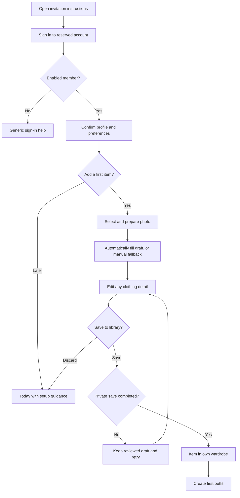

# User flows and original interface

**PROPOSED visual direction:** a warm, quiet wardrobe notebook. Soft ivory canvas, deep green actions, clay accents and generous image space. Use original geometric icons, restrained borders and clear text. No copied branded layouts, promotional illustrations or social-feed elements.

## Navigation

Four persistent phone destinations: **Today**, **Wardrobe**, **Outfits**, **Calendar**. The top bar always shows the current person's initials/name and “My wardrobe”. Its menu opens Statistics, Settings and Sign out. On desktop, use a left rail with the same order and labels. An Add item button is present in Wardrobe and the empty Today screen; avoid a floating control covering content.

Use browser hash routes (`#/today`, `#/wardrobe`, `#/items/new`, `#/items/:id`, `#/outfits`, `#/outfits/new`, `#/outfits/:id`, `#/calendar`, `#/stats`, `#/settings`, `#/trash`). Browser Back/Forward works through `hashchange`; no router dependency. Filters stay in session memory rather than URLs. Only the static shell is publicly retrievable; protected routes require Auth and an enabled profile.

## First use and daily journeys

Onboarding asks for a display name, timezone/currency confirmation and optional style/colour preferences. Weather remains off. Offer “Skip for now” for every preference. Explain owner-only app access separately from optional AI processing: enabling automatic tagging sends prepared clothing photos to the named provider under the notice in `20`. Each owner decides independently, once in setup/settings; no per-photo approval. Seed no fictional clothes into production. Suggest adding three useful items, not photographing the whole wardrobe before receiving value.

Daily: Today → choose date/occasion/indoor-or-outdoor → see up to three suggestions with short reasons → open one → “Wear today” or “Plan for date”. Both create/update explicit events; opening or favouriting a suggestion does not count as a wear. A user can choose an existing outfit without invoking the engine.

Capture: camera/library → crop/rotate → automatic analysis → prefilled editable item form → **Save to library** → private upload/commit → item detail. The photo is the only starting input; title/category are filled automatically where identifiable. Show the photo beside the form and allow editing every garment field, including the description, before saving. No item exists in the library before Save. Unknown facts stay blank; estimates are labelled.

Use inline "Reading clothing details" status in the existing editor, not a new wizard or a separate suggestion action. The form remains editable; analysis fills untouched fields only. Failure/timeout offers retry or Continue manually. Save waits for settled analysis or explicit manual continuation, then freezes the displayed values. There is no later AI writeback to the saved item.

Discard creates no library records/images and clears the draft. It does not refund an already-sent analysis; disclose that in setup. A failed library save preserves the reviewed in-memory draft and the same item/image request IDs for retry, without another AI call. Navigation asks "Discard this unsaved item?" where supported; phone reload/closure warnings are best-effort.

## Screen inventory and states

All screens inherit: English/Finnish/Swedish catalog text and locale formatting, visible account indicator, 44 px controls, focus management, connection banner, non-blocking loading skeletons and explicit unsaved changes. English copy below is the specification reference, not permission to hardcode UI strings. Follow `19-LOCALIZATION.md`; longer Finnish/Swedish labels wrap without clipping and `<html lang>` tracks the active interface. Loading skeletons use `aria-busy`, not meaningless spoken placeholders. Errors receive an `aria-live="polite"` explanation and an actionable retry; destructive failures are not dismissed automatically.

| Screen | Wireframe / primary action | Empty/loading state | Error/offline/confirmation |
|---|---|---|---|
| S01 Sign in | Centred name mark, native-name language selector (English/Suomi/Svenska), email/password labels, show-password control, Sign in; no signup link | Browser-language negotiation or current in-memory choice; submit spinner preserves fields | Generic localized sign-in error; offline disables submit. Signed-out language choice does not change an existing account. |
| S02 Profile/preferences | Own name badge, language selector, separate timezone/currency, colour/style chips with text, coverage/repeat settings | Saved owner language wins; unset preference follows `19`; optional chips can be empty | Localized field errors and version conflicts. Offline language saving is disabled without discarding other in-memory edits. “Preferences saved.” |
| S03 Today | Date/occasion/context strip; weather chip if enabled; up to three image compositions with reasons | “Add a few clothes to get started”; skeleton reserved card areas; one available result stays one | Missing weather labelled; missing slots listed; owned suggestions labelled stale offline. “Outfit marked worn. Undo.” |
| S04 Wardrobe | Search, Filters button, result count, image grid, Add item; own/private label | “Your wardrobe starts here” with camera/library options; first 40 placeholders | No matches offers Clear filters; failed refresh keeps visibly stale own data while current session exists. Offline remote writes disabled. |
| S05 Item capture/edit | Photo first; crop/rotate; AI-filled title/category/details/description; all fields editable; Save to library / Discard | Preparing photo, Reading clothing details, then editable draft; not-detected fields clearly identified | AI failure/budget stop offers retry/manual completion. No library writes until Save. Changing photo/cancel/Save invalidates late results. Save failure retains reviewed values. |
| S06 Item detail | Saved image/name/metadata, Private badge, availability, favourite, wear summary; Edit / Add to outfit | Incomplete save is not completed inventory; missing historical media uses placeholder | No post-save tagging. Edit any garment detail or description. Photo replacement opens a draft and preserves current image until explicit Save commits. |
| S07 Outfits | Image compositions in two-column cards, name and occasion, Create outfit | “Build your first combination”; skeletons | Empty filter result distinct from no outfits. Offline view can show current-session owned compositions with stale label; no saves. |
| S08 Outfit editor | Named ordered slots; Add item picker; Move up/down, Remove; Save | Empty slots have labelled Add controls, not blank drop zones | Duplicate/foreign refs rejected. Inactive historical components show unavailable. Conflict offers reload/copy draft. “Outfit saved.” |
| S09 Outfit detail | Composition, item list, reason/occasion; Plan / Wear / Edit | Missing historical pieces show text placeholders | Never silently replace a missing item. Only owned refs can be saved. Worn confirmation includes date and Undo. |
| S10 Calendar | Month control plus accessible agenda list; selected date; planned/worn labels; Add look | “No plans for this day”; loading maintains selected date | Multiple looks supported. Future “Mark worn” disabled with text. Delete event uses Undo; failed mutation leaves original event. |
| S11 Statistics | Wear counts, unworn list, most/least used items, cost-per-wear table; currency selector | “Mark an outfit worn to see your first statistics” | Unknown values are em dashes with accessible descriptions. No cross-currency grand total. Offline figures marked session-stale. |
| S12 Settings/data | Profile/language, weather consent/city, automatic-tagging switch/provider notice, own AI allowance/status, installation help, export/restore, backup status, delete account, Sign out | Backup status “No backup recorded on this device”; no inferred AI consent | Localized provider/retention/cost notices. Disabling tagging stops new calls, not already-delivered provider data. Restore never enables AI or triggers charges. No other account's consent, usage or language appears. |
| S13 Trash | Own trashed items/outfits/history grouped by type with days remaining; Restore / Delete permanently | “Trash is empty” | Restore affects only the owner. Permanent deletion requires named confirmation, no Undo; retry interrupted byte cleanup. |

No trips screen is delivered in the MVP. Optional Phase 8 adds S14 Trips: trip list, dates/destination, owned packing checklist with packed count, missing-item states and deletion confirmation. It is hidden until that phase is explicitly authorized and complete.

## Confirmations, undo and concurrency

Optimistic feedback is suitable for favourite/availability changes and reversible trash, but rollback if the write fails. Do not optimistically report a full export or permanent deletion as completed. The short toast Undo window is 8 seconds; Trash remains the seven-day recovery path. Mark-worn Undo returns the event to planned or removes the newly created event, depending on the original action; it must not remove pre-existing history.

Account deletion has a typed `DELETE` confirmation, current password check, affected-data summary and Export first link. Successful deletion clears the session; pending deletion shows a recoverable progress state.

When a version conflict occurs: “This entry changed or is no longer available. Reload to continue.” Keep a copy of unsaved form text in memory and let the user compare after reload; never merge prices/status or overwrite changed records automatically.

AI results apply only to untouched fields of the current unsaved draft. A manual clear stays clear; a new photo invalidates older image results. Save, discard, logout and account changes stop any later result from altering displayed/saved data. Estimates stay estimates even when the user saves without editing. Status uses muted text and polite announcements. The existing item form is the review surface; no per-field approval checklist.

## Original design system

| Token / component | Specification |
|---|---|
| Canvas / surface | `#F6F3ED` / `#FFFFFF`; optional image well `#ECE8DF` |
| Primary ink / secondary ink | `#24332E` / `#59665F` |
| Primary action | `#355D4E` with white text; hover `#294B3E` |
| Accent | `#A45E45` fill with white text; use as a decorative accent otherwise, not small text on ivory; not the only status cue |
| Error / focus | `#A33232` with text label; focus outline `#176B73`, 3 px, 2 px offset |
| Border | `#D8DED7` decorative borders only; input/focus boundaries use darker `#78877D` when needed for contrast |
| Typography | System UI stack only. Body 16 px/1.5; small text 14 px/1.45; titles 24–30 px/1.2; no thin weights. Respect user font scaling. |
| Spacing | 4, 8, 12, 16, 24, 32, 48 px; phone page padding 16 px, desktop 32 px |
| Corners / elevation | 12 px cards, 8 px controls; hairline borders; a subtle shadow only for raised dialogs/menus |
| Image cards | 4:5 image well with `object-fit:contain`; never crop the garment automatically for detail; text name below, not over image |
| Grids | 2 columns at 320–599 px; 3 at 600–899; 4–5 above 900 depending rail; cards remain ≥140 px wide |
| Buttons | Primary filled, secondary outline, destructive labelled; minimum height 44 px; distinguish disabled/loading states in text/semantics |
| Forms | Persistent labels; unit/currency adjacent to value; inline help; optional details collapsed behind a labelled button |
| Icons | Small original inline SVGs for navigation/actions with text labels. Decorative icons `aria-hidden`; standalone controls have explicit accessible names |
| Motion | 120–180 ms transitions; respect reduced-motion; no parallax, animated background or required swipe interaction |

Use a 1,120 px content maximum on desktop. Keep image loading dimensions reserved to avoid layout jumps. No bottom sheet may trap content below a phone keyboard; editors use full-height scrollable views with actions reachable at 200% text size.

## Accessibility acceptance

Text must meet 4.5:1 normal / 3:1 large contrast; meaningful UI boundaries/focus meet 3:1 where applicable. Token contrast is checked in the package validation; every actual component pairing still needs verification after implementation. Do not rely on colour for Private, laundry status, plan/worn or validation errors.

Use semantic headings, lists, fieldsets, buttons and an agenda alternative to calendar-grid navigation. Focus moves to the new screen heading, the first invalid field after submit, and back to the invoking control after a dialog. Escape closes dismissible dialogs; modal focus is contained. All garment images have editable owned alt text, such as “Olive cotton overshirt, front view”.

Keyboard and screen reader must support selecting photos, adjusting crop without dragging, reordering outfit items, choosing calendar dates, exporting and deleting. Test with VoiceOver/Safari and TalkBack/Chrome on actual phones; automated axe checks supplement these paths and do not certify them.
