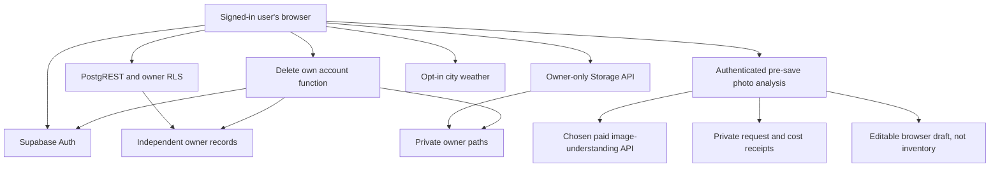

# Architecture

## Platform decision

**PROPOSED: build one React/TypeScript PWA with Vite, Supabase and static hosting.** The two users need camera/library capture and private daily access, not store distribution. A native wrapper is an option to revisit, not a second codebase to start now.

Scores are design judgments from 1 (poor fit) to 5 (strong fit), equally weighted. They are not benchmark results. Browser installation and camera behaviour must be checked on the two actual phones at Phase 0. “Wrapper” scores describe the eventual wrapper, including its additional maintenance.

| Criterion | Responsive PWA | Expo React Native | PWA then native wrapper |
|---|---:|---:|---:|
| Operating/development cost | 5 | 3 | 4 |
| iPhone installation experience | 3 | 4 | 4 |
| Android installation experience | 4 | 5 | 5 |
| Camera and photo library | 4 | 5 | 5 |
| Offline capabilities | 3 | 5 | 4 |
| Notification capabilities | 2 | 5 | 4 |
| Maintenance | 5 | 3 | 3 |
| Deployment effort | 5 | 2 | 3 |
| Avoiding App Store requirements | 5 | 2 | 2 |
| Avoiding Apple membership cost | 5 | 2 | 2 |
| Copilot implementation simplicity | 5 | 3 | 4 |
| Suitability for exactly two users | 5 | 3 | 4 |
| **Total / 60** | **51** | **42** | **44** |

The PWA installation path is a browser/home-screen action; provide short iOS and Android instructions after first successful use. Do not promise identical prompts in all browsers. Camera capture uses a normal file input with `accept="image/*"` and a separate camera-oriented input with `capture="environment"`; capture is a hint, not a reliable native camera API. Always keep a photo-library option.

Expo would provide stronger native integration, but would require mobile signing, distribution, native builds and more platform-specific verification. A wrapper could reuse the web UI, but still needs native permission and store work. **CONFIRMED:** Apple lists $99/year for Developer Program membership; local free development is distinct from durable distribution. [Apple Developer Program](https://developer.apple.com/programs/) · accessed 2026-09-05. The PWA incurs no Apple membership cost.

## Components and trust boundaries

**No household, partner link, peer directory, sharing table, recipient column or cross-account operation exists.** Each profile and all related records point only to their own Auth identity. The private approved-account table contains independent administrative admissions and enforces the requested two-login limit; it creates no relationship between profiles and is invisible to application users.

Use one Supabase project in **Stockholm (`eu-north-1`)**, explicitly selected rather than the generic Europe grouping, with owner RLS and one static deployment. This is application/data isolation, not separate infrastructure administration: the operator can administer the project and quotas are shared. No other account's name/activity/usage is exposed. Function execution and external AI regions are separate decisions; do not infer Stockholm processing for either from the database region.

* Browser: untrusted for identity/ownership. Uses only its own user session and a publishable key. Runs UI, rule engine, image processing and export chunking.
* Postgres: all twelve base tables use RLS; I29 adds private analysis requests/usage and saved-item provenance. Every addition enforces owner/server boundaries. Draft analysis creates no inventory records.
* Storage: private bucket, reserved immutable owner paths, no public image or sharing URL feature. Authenticated downloads are converted to temporary Blob URLs in the browser.
* AI analysis Edge Function: authenticated `analyze-clothing` accepts a prepared JPEG before library Save, checks owner consent/budget and returns validated fields into the editable draft. Provider credentials stay server-only; the endpoint never writes item/image records.
* Deletion Edge Function: separate privileged endpoint. Authenticates the user and password again, derives the target from the verified session, and removes only that owner's files/rows/identity. It never accepts a target account in request JSON.
* Operator: performs admission, migrations and disaster recovery. This privileged role is outside the product and is not granted to either user by their application login.

No backend framework, SSR, ORM, realtime subscription, inference queue/scheduler, shared-media proxy or user-to-user API. The former background tagging worker is superseded by request/response draft analysis with bounded receipts. Cleanup/backup use owner-authenticated tools; privileged maintenance is restricted.

## Dependencies

All choices below are **PROPOSED**. Licence declarations below are **CONFIRMED** from the linked repositories, accessed 2026-09-05. Repository pages were available and not shown as archived; their rendered release timestamps were not exposed. Exact release recency is **unverified**, so Phase 0 must record the chosen stable versions and maintenance dates before accepting the lockfile. Do not describe these as “latest verified versions.”

| Direct runtime dependency | Purpose / licence | Maintenance evidence and preference | Simpler alternative |
|---|---|---|---|
| `react` | Component/state model; MIT | Established upstream repository and contribution/security processes; use stable React 19-compatible packages. Familiar, typed UI structure reduces Copilot ambiguity. | Plain DOM would remove a dependency but make forms, async states and accessibility harder to keep consistent. |
| `react-dom` | Browser rendering; MIT | Same upstream/version family as React; must match React version. | Native DOM rendering has the same tradeoff. |
| `@supabase/supabase-js` | Auth refresh, typed REST/RPC, private Storage and functions; MIT | Upstream SDK monorepo documents browser/runtime support and component SDKs. Avoid writing a custom refresh-token implementation. | Direct fetch is used in the test harness but not as a substitute for app authentication lifecycle handling. |

Sources: [React repository](https://github.com/react/react), [Supabase SDK repository](https://github.com/supabase/supabase-js).

The Supabase distribution includes Auth, PostgREST, Storage, Functions and Realtime component SDKs under its MIT repository. Realtime is not enabled by this app. React DOM uses React's scheduler where resolved. **The exact transitive graph is not fixed until dependency resolution.** Issue I01 must generate `docs/dependencies.json` and `THIRD-PARTY-NOTICES.txt` for *every resolved production package*, including transitive packages, with version, SPDX licence, purpose (or introducing parent), upstream, maintenance evidence and alternative/removal rationale. Missing/unknown licences fail CI; a critical security advisory fails CI until resolved. This gate avoids claiming a complete version-specific inventory before installation. No additional direct runtime package is approved by this blueprint.

Build/test tools are not shipped in the browser: TypeScript, Vite, a React Vite plugin if required by the chosen stable Vite version, ESLint, Vitest, Playwright and axe-core for tests. Vite is an MIT static-app build tool. [Vite repository](https://github.com/vitejs/vite) · accessed 2026-09-05. Use Node 24 as the selected development baseline, record exact tool versions in the lockfile, and inventory their licences in a separate development section. Do not add a UI kit, icon package, router, date library, query cache, image codec, ZIP package or service-worker framework by habit.

Native browser facilities cover hash routing/back navigation, `Intl`, CSS, fetch, Blob URLs, canvas, Web Crypto, `CompressionStream`, service worker and file inputs. Node standard libraries cover command-line encrypted backup streams. These are platform dependencies; they add no package licence or fee. Browser support/fallback is tested, not assumed from a package being absent. AI provider calls live only in the backend; use supported server authentication libraries where necessary and inventory them separately. Do not hand-roll Google Cloud credential signing merely to avoid a server dependency.

## AI versus outfit rules

The split remains **automatic draft tagging, deterministic outfits**. `21-AI-MODEL-COMPARISON.md` compares current Google, OpenAI, Anthropic and Mistral options. Provisional start: Google Cloud EU `gemini-3.5-flash-lite`; compare GPT-5.4 Mini and GPT-5.6 Luna where provider/region eligibility permits. This is deployment fit, not proven image accuracy or lowest price. One model is sufficient; no automatic provider failover, outfit AI, embeddings or training.

After setup consent, completing photo preparation automatically analyzes it and fills title/category/details in the existing editor. The owner can edit everything before explicit Save; only then are the item and persistent images created. Saved attributes feed search/`09` without further inference. Unknown warmth/protection is not guessed. There is no post-save enrichment or guaranteed unsaved-draft recovery after browser closure.

## Image processing and optional segmentation

Use a small `processImage()` module built on browser decoding and canvas. It does not forward metadata, embeds only freshly encoded pixels and creates two JPEGs. A contract prototype passed in Chromium 149: all eight EXIF orientations, EXIF/GPS/XMP removal, JPEG/PNG/WebP inputs and bounded JPEG outputs. `validation/VALIDATION-REPORT.md` records the exact scope. The app module, HTMLImageElement fallback, HEIC handling, visual quality and physical iPhone/Android performance still require implementation tests.

**CONFIRMED:** `@imgly/background-removal` advertises browser-local processing and uses AGPL-3.0. [IMG.LY repository](https://github.com/imgly/background-removal-js) · accessed 2026-09-05. It is not installed in the MVP. A later experiment must review licence obligations/model redistribution, self-host model assets, confirm no photo/model telemetry, and achieve <10 s processing without tab termination on both actual phones. A paid licence is not part of the plan. The default provider returns `unavailable`; a plain crop is the simpler accepted alternative.

## State and failures

Localization is MVP scope in all phases: one static English/Finnish/Swedish catalog, typed text interpolation and native `Intl` formatting, with no additional runtime dependency or service. `profiles.ui_language` is an owner-only preference. `19-LOCALIZATION.md` defines initialization, fallback, account reset and import compatibility; all new UI text must pass the three-language CI gate.

Keep one session-scoped React data store with owner UID in every cache key. Fetch the owner's compact item metadata once per session and refresh after writes/focus. At 500 items, local text search and the rule engine need no search service. Paginate images independently. Record lists beyond 1,000 rows use explicit keyset pagination; never rely on the service's default response row limit.

| Failure | Behaviour |
|---|---|
| Supabase paused/unreachable | Preserve in-memory unsaved draft; show retry and local export of draft text; no successful-save message. Operator resumes the project. |
| Access token expired | SDK refreshes once; otherwise lock protected UI and reauthenticate. No fallback to anonymous data. |
| Weather unavailable/stale | Use manual temperature/context or neutral rules; clearly label missing weather. |
| Private media missing/denied | Remove blob URL and show “This photo is no longer available”; never use another account or a public URL as fallback. |
| Image too large/unsupported | Explain and offer another photo, lower resolution or JPEG conversion; raw source is not uploaded as a shortcut. |
| AI analysis disabled, unavailable or allowance exhausted | Keep the unsaved draft editable; explain unknown fields and allow manual completion/Save. No unapproved call, automatic library save or fabricated attributes. |
| Image enhancement disabled | Return unavailable immediately; cropped photo still works. This is separate from first-release automatic tagging. |
| Restore interrupted | Resume the same owner/import ID; successful records remain identifiable; account isolation remains unchanged. |

## Consequences and tests

The stack targets low-cost infrastructure plus bounded paid analysis and keeps wardrobe data out of static hosting. Privileged runtime work is limited to checked analysis/receipts and own-account deletion. Test draft/result/usage isolation, zero inventory writes before Save, late responses and explicit-save retries alongside existing boundaries. Model suitability, phone handling and provider/recovery configuration remain implementation gates.
