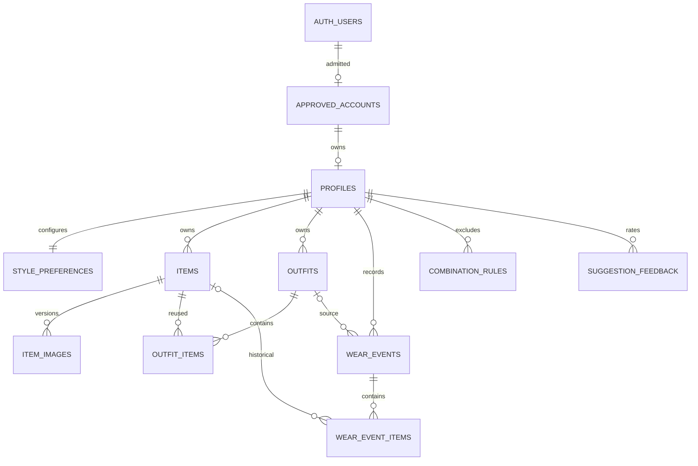

# Data model

`07-DATABASE-AND-RLS.sql` is the executable **revision 1.1 base schema**, with twelve application tables. Revision 1.3 requires I29's planned pre-save analysis/provenance migration below and in `20`; it is not implemented in the supplied SQL. Auth/Storage remain provider-managed; profiles have no account relationship.

## Planned AI schema extension - I29

Implement `supabase/migrations/20260906000000_automatic_tagging.sql` after the base. Add owner-specific analysis consent, typed pattern/length and per-field provenance/revisions, plus private `ai_requests`/`ai_usage` receipts. There is no `ai_jobs` table or scheduled inference. Protect receipts/results with owner-scoped APIs and server-only table grants. Checked Save/edit operations validate provenance; analysis cannot write inventory. Add owner/version-checked `alt_text` editing without altering media paths/bytes.

Unentered physical properties remain unknown. Preserve old values but mark provenance-less values unverified. Manual empty values retain user provenance. AI fills only untouched fields in the current draft; persist the reviewed values/provenance on explicit Save, not on analysis completion.

I29c source migration `20260909110000_item_optional_collections.sql` changes only
the `colours`/`seasons` checks and future defaults: non-null text arrays may have
0–3 colours and 0–4 valid season codes, defaulting to `[]`. It performs no old-row
update. Historical `['unknown']` colours and all-four-season values, timestamps,
versions and provenance remain exactly as stored. The unknown sentinel is not a
known physical colour; absence of a provenance entry still means unknown/revision
0. Empty collections express unentered facts or a recorded manual clear, not
fabricated protection. The 40-code-point bounds on newly entered style words/tags
are client limits, not per-element SQL limits on colours or style tags. SQL retains
the tags array's 12-entry and joined-UTF-8 512-byte bounds.

The form's closed field builder excludes system columns. This is not a claim
that the existing items grant denies all system-looking input: `touch_record`
denies identity UPDATE and controls UPDATE timestamps/version, while the owner
can still write `deleted_at` and some INSERT metadata under the existing grant.
I29c adds no grants, policies, functions, columns or trigger changes.

Analysis creates no item/image records: photo/title/category are checked only on Save. Failed explicit saves may leave incomplete upload reservations, excluded from completed inventory/derived data. Image commit never enqueues analysis. Discard removes temporary results; expiration purges remaining bounded results. Account deletion cascades request/usage data. Metadata-v2 export contains saved fields/provenance, not drafts/results/usage or active consent. The base diagram below predates these additions.

## Entities

### I29e source-only request controls

`20260909180000_ai_request_controls.sql` adds three protected profile fields:
`ai_enabled` defaults false; nullable positive-int32 `ai_notice_revision` and
`ai_consented_at` are paired. Only the consent RPC changes these through the
ordinary API. The twelve preexisting profile UPDATE columns remain granted.
No old profile values, item/image/history data or provenance authority change.

Three RLS-enabled private tables have no client table grants/policies:

* `ai_controls`: one operator-configured row per owner, activation, notice,
  opaque model/prompt, exact positive bigint micro-USD limits, hourly rate
  1–1000 and result TTL 1–86400 seconds. Migration inserts no configuration.
  Missing means UNCONFIGURED/effective zero allowance, not unlimited.
* `ai_usage`: one `(owner_id,request_id)` ledger/tombstone, immutable original
  UTC month/reservation, admitted time, accounted amount, reserved/held/settled/
  released charge state, minimal dispatch evidence and bounded closure reason/time.
  No draft ID, photo hash, model, facts, provider body or aggregate balance row.
  It survives temporary-request deletion until owner deletion.
* `ai_requests`: same-owner ledger FK, draft/generation/hash, pinned model/prompt/
  notice, reserved/dispatched/ready status, original timestamps and bounded facts.
  One active reserved/dispatched request per owned draft. Full context is deleted
  on discard, failure or expiry; no content recreation from a tombstone.

Each table also references the owner's profile with ON DELETE CASCADE. All AI
mutations lock that profile first, then controls, ledger and full request; the
profile lock alone changes no profile version/timestamp. Accounting remains
separate from permission to dispatch/store/return content. Unknown dispatched
charges stay held; known zero differs from unknown; actual overruns are recorded.

This is not a provider endpoint, image validation/transfer, checked Save, saved
marker or inventory authority. Export v2 removes the three consent fields and
still preserves legacy imageless/pending rows. Saved-only export remains open.
Logical expiry and bounded opportunistic deletion do **not** guarantee physical
purge for inactive accounts within 24 hours. A reviewed scheduler and separate
processor/account, notice, allowance and deployment approvals block activation.

| Table | Meaning and lifecycle |
|---|---|
| `private.approved_accounts` | Independent approval rows, admission numbers 1 and 2 for capacity only, lower-case email, Auth UUID and enabled flag. RLS enabled with no client table rights. Insert/update Auth triggers enforce admission and fixed emails. |
| `private.deletion_jobs` | Minimal resumable deletion receipt, keyed by owner. No Auth FK because it must survive Auth deletion. Server-only, purge seven days after completion; no content or raw error strings. |
| `profiles` | Own display name, nullable initial `ui_language` (`en`, `fi`, `sv`), timezone, currency and optional rounded weather city coordinates. Created during admission, not by self-registration UI. Language does not change timezone/currency or connect profiles. |
| `style_preferences` | Own colour/style/exclusion/coverage/repeat preferences. One row per owner. Never shared. |
| `items` | Manual wardrobe metadata, availability, lifecycle, feedback flags, soft deletion and version. Price stays in recorded currency. |
| `item_images` | Immutable main/thumb paths, hashes, sizes, alt text and pending/ready/retired state for one item image version. Server `retired_at` starts its recovery window; at most one ready image per item. |
| `outfits` | Owned name, occasion, notes and favourite status, with soft deletion/version. No stored collage bitmap. |
| `outfit_items` | Ordered 1–12 item references when saved via RPC. Composite owner FKs prevent cross-owner links. Same item may appear in many outfits. |
| `wear_events` | A planned or worn look on a local date in a stored timezone. Multiple looks/day allowed; future dates cannot be marked worn. Optional source outfit. |
| `wear_event_items` | Items actually planned/worn, with immutable title/category snapshots. A permanently deleted item becomes a null link while its history text survives. |
| `combination_rules` | Canonical pair of owned item UUIDs which must never be suggested together. Lower UUID first; pair is unique. |
| `suggestion_feedback` | Vote on a canonical array of 1–12 owned item IDs, with a server-derived SHA-256 signature. IDs make feedback portable during restore. No photo, prompt or copied preference state. Exact dislike suppresses that combination; permanent item deletion removes now-impossible combination feedback. |

## Relationship diagram

The deletion receipt deliberately has no relationship edge to a deleted identity. The diagram is explanatory; the SQL, foreign keys and tests establish the actual rules.

## Ownership and admission

Independent approved-account rows enforce a maximum of two logins and immediate account freeze. Application users cannot query the admissions, enumerate users, address another profile or see another account's name/email. There is no pair record, peer RPC or user-level administrator role.

All relationships capable of linking private records use `(owner_id, id)` FKs. A guessed foreign UUID cannot make an owned outfit or wear event refer to the spouse's original data. The original tables' four DML policies always require both `private.is_approved()` and `owner_id=auth.uid()`. Profile creation/deletion, image state, account admission and restore imports have narrower privileges documented in SQL.

## History and counts

* A wear count is the number of **distinct `local_date` values** on non-deleted `worn` events containing that item. A shirt in two looks on Tuesday counts once. Last worn is the maximum such date.
* Plans do not count until explicitly marked worn. Changing a timezone later does not move existing local-date records. DST never changes the date string.
* Cost per wear = stored item purchase price / counted wear days, rounded for display only. Unknown price or zero days displays an em dash; a known zero price with wear displays 0. Totals group by currency, never add EUR and USD together.
* Archiving/donating/selling changes future eligibility, not historical counts. Trash hides normal views and suggestions without affecting any other account.
* Permanent item deletion removes current outfit links. Wear snapshots keep their own historical title/category and null `item_id`. Statistics for a deleted item are no longer shown as current inventory; historical looks remain understandable.
* A whole account deletion removes that owner's history as well. “Keep historical snapshots” is not an exception to account deletion.

Outfit and wear multi-row writes use `save_outfit` / `save_wear_event`. Unchanged wear-event links retain original snapshots. Editing only date/state/label can PATCH the event with a version predicate, preserving all links, including historical null-link entries. A historical null-link entry may be explicitly removed by its owner.

## Images and deletion

One image version represents two files. New versions receive new UUIDs; storage upsert is disabled. `commit_image` serializes versions, checks that both object records exist, retires the previous ready version and makes the new one ready atomically. Size/hash validation is also required in the client image pipeline; SQL existence is not proof of valid image bytes.

I29b Stage 1 source migration `20260909070000_item_description_edit.sql` adds
`item_images.description_version`: a non-null bigint, default 1, bounded to
1–2147483647. This is a description concurrency counter, not a media version,
item `version`, provenance revision or request receipt. Existing images begin at
1 without rewriting their descriptions or other old fields. Only the checked
`update_image_description` RPC advances it, on every matched expected-counter
write including same-text writes. Ordinary reservation INSERT cannot supply it;
direct image UPDATE/DELETE remain unavailable.

`alt_text` stays non-null and now permits 0–240 PostgreSQL characters. `''` is
an intentional clear, valid even at counter 1. A future restore reserves a new
owned image with that exact saved text, including empty text, and starts its own
counter at 1 rather than copying the exported counter. The RPC changes only
description text/counter on the owned current ready image of a non-deleted item;
immutable identity, paths, hashes, bytes, state, timestamps, item fields and
history remain unchanged. Raw metadata-v2 exports naturally include the counter;
saved-only export completion, restore implementation and the rest of I29 remain
unfinished. This source addition grants no hosted migration or deployment authority.

Retired versions remain for seven days from server `retired_at`, regardless of their original upload date. Pending age uses `created_at`; retired age uses `retired_at`. `retire_image` can register an imported historical image without changing the current ready version. Recovering an old photo creates a new version from its saved bytes. Storage removal must precede forgetting metadata. Item deletion can leave storage orphans after an interrupted job; compare actual bucket keys against image rows, not just SQL foreign keys. See `08` and `17`.

## Data intentionally not stored

Categories and standard colours are a versioned TypeScript taxonomy plus SQL category constraints; no mutable global taxonomy table. Per-item tags are bounded arrays. Suggestions are short-lived browser results; no suggestions table. Weather is a three-hour memory cache keyed by rounded city, date and units; no weather table. No detailed behaviour/audit table is needed; retain minimal deletion receipts and provider security logs. No user activity from one account is exposed to another.

Trips/packing are `D01`, deferred Phase 8. Its later migration will add `trips(id,owner_id,title,start_date,end_date,timezone,city,latitude,longitude)` and `packing_items(owner_id,trip_id,item_id,packed,quantity)` with owner-only RLS, composite FKs and `quantity` 1–20. Do not add these tables to the MVP migration or expose a trips screen in Phases 0–7.

## Fictional example records

| Entity | Example |
|---|---|
| Profile A | `display_name="Alex"`, `timezone="Europe/Helsinki"`, `currency="EUR"`, weather disabled |
| Profile B | `display_name="Robin"`, own independent preferences, weather disabled |
| A item | Olive cotton overshirt, `top`, `casual` formality 1, price EUR 75, ready/active |
| B item | Blue trousers, `bottom`, price unknown, laundry/active |
| A outfit | “Weekend errands”, ordered overshirt/trousers/trainers, three owned IDs |
| A history | One worn event dated `2026-09-04`, each item linked once |

Fixture UUIDs and executable inserts are in `validation/check-sql.mjs` and the normal-session harness. No real identity or wardrobe data belongs in seeds.

## Index/performance rationale

Owner/category/date indexes bound ordinary item views; owner/date indexes bound calendar history. Owner/foreign-key indexes avoid scans on cleanup and account deletion. The partial unique ready-image index establishes the one-current-image rule. Owner/title supports sorting; free-text matching remains local because each wardrobe is about 500 rows. No global full-text index, cross-user materialized statistic or recommendation cache is warranted. Revisit only if measured owner-scoped query latency exceeds 200 ms or the wardrobe grows above 5,000 items.
